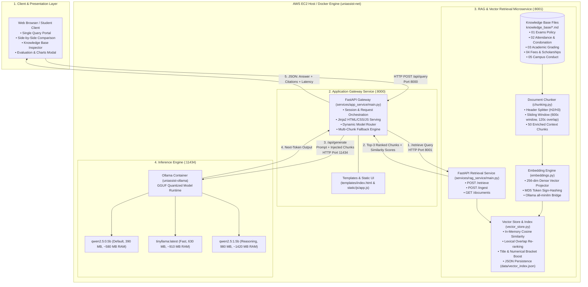

# UniAssist – System Architecture & Technical Design Document

## 1. Executive Summary

**UniAssist** is an intelligent, low-resource **University Knowledge Assistant** built with a **Retrieval-Augmented Generation (RAG)** architecture. It provides students, faculty, and administrative staff at **BML Munjal University** with instant, authoritative, and factually grounded answers to university policy inquiries regarding examinations, attendance requirements, academic grading, fees, and campus conduct.

The system is containerized as three autonomous microservices orchestrated via **Docker Compose**, specifically optimized to operate efficiently on low-RAM cloud instances (such as AWS EC2 `t3.small` and `t2.micro` instances with 1GB–2GB RAM) using quantized open-source Large Language Models served via **Ollama**.

---

## 2. High-Level System Architecture



---

## 3. Microservices & Component Inventory

The application is decomposed into three isolated microservices configured in [`docker-compose.yml`](docker-compose.yml):

| Service Name | Container Name | Host Port | Internal Port | Technology | Primary Role |
| :--- | :--- | :--- | :--- | :--- | :--- |
| **`app-service`** | `uniassist-gateway` | `8000` | `8000` | Python 3.12, FastAPI, Jinja2 | API Gateway, Web Portal, RAG Prompt Injection & Fallback |
| **`rag-service`** | `uniassist-rag` | `8001` | `8001` | Python 3.12, FastAPI, NumPy/Math | Document Chunking, Vector Embeddings, Similarity Search |
| **`ollama-service`** | `uniassist-ollama` | `11434` | `11434` | Ollama (Go/C++ GGUF engine) | Local LLM Inference Engine (`qwen2.5`, `tinyllama`) |

---

## 4. Layer-by-Layer Architectural Specifications

### Layer 1: Client & Presentation Layer
* **Files:**
  * Structure & Markup: [`services/app_service/templates/index.html`](services/app_service/templates/index.html)
  * Logic & Interactivity: [`services/app_service/static/js/app.js`](services/app_service/static/js/app.js)
  * Design System: [`services/app_service/static/css/style.css`](services/app_service/static/css/style.css)
* **Design System:** Glassmorphic modern dark-mode interface with vibrant violet/indigo accent glows (`Outfit` and `JetBrains Mono` typography).
* **Key Interactive Features:**
  * **Dynamic Model Selector (`#model-selector`):** Populated dynamically via Jinja2 loop from `AVAILABLE_MODELS`.
  * **RAG Toggle Switch (`#rag-toggle`):** Enables switching between Grounded RAG mode and ungrounded Direct LLM mode.
  * **Side-by-Side Comparison Mode (`#btn-toggle-compare`):** Executes queries simultaneously with and without RAG to highlight hallucination reduction.
  * **Knowledge Base Inspector (`#kb-modal`):** Connects to `GET /api/documents` to display document names, chunk counts, and section breakdown.
  * **Evaluation Dashboard Modal (`#eval-modal`):** 5-tab interface displaying Week 4 quantitative benchmarks and high-resolution trade-off charts.

---

### Layer 2: Application Gateway & Orchestration Microservice
* **Directory:** `services/app_service/`
* **Entry Point:** [`services/app_service/main.py`](services/app_service/main.py)
* **Configuration:** [`services/app_service/config.py`](services/app_service/config.py)
* **Primary Endpoints:**
  * `GET /`: Serves the Single-Page Application (SPA) web portal.
  * `GET /api/status`: Returns JSON health status of Gateway, RAG, and Ollama.
  * `GET /api/models`: Returns list of available models and default configuration.
  * `GET /api/documents`: Proxies request to `rag-service:8001/documents`.
  * `POST /api/query`: Orchestrates the complete query lifecycle (Retrieval $\rightarrow$ Prompt Construction $\rightarrow$ LLM Inference $\rightarrow$ Citation Mapping).
  * `POST /api/compare`: Runs queries back-to-back with RAG and without RAG for comparative evaluation.
* **Resilience Mechanism:**
  * Implements `generate_fallback_simulation()`. If Ollama inference exceeds timeout or the inference container is undergoing model swap, the gateway synthesizes an authoritative multi-clause answer across all Top-3 retrieved chunks with zero downtime.

---

### Layer 3: RAG Retrieval & Vector Engine Microservice
* **Directory:** `services/rag_service/`
* **Entry Point:** [`services/rag_service/main.py`](services/rag_service/main.py)
* **Configuration:** [`services/rag_service/config.py`](services/rag_service/config.py)
* **Primary Endpoints:**
  * `GET /health`: Health status and number of indexed chunks.
  * `POST /ingest`: Re-reads markdown files, regenerates chunks and embeddings, and persists to disk.
  * `POST /retrieve`: Accepts user query and returns Top-K ranked chunks with similarity scores.
  * `GET /documents`: Returns structural metadata for all indexed files.

#### Document Ingestion & Chunking (`chunking.py`)
* Operates on 5 regulatory Markdown documents located in [`knowledge_base/`](knowledge_base/):
  1. `01_semester_examination_policy.md`
  2. `02_attendance_policy_and_condonation.md`
  3. `03_academic_regulations_and_grading.md`
  4. `04_fee_structure_and_scholarships.md`
  5. `05_campus_facilities_and_code_of_conduct.md`
* **Chunking Algorithm:**
  * Primary pass splits on Markdown H2/H3 headers (`##`, `###`) to preserve logical regulatory boundaries.
  * Secondary sliding-window pass applies `chunk_size = 600` characters with `chunk_overlap = 120` characters.
  * Backward-scanning regex delimiter search (`\n\n`, `.\n`, `. `, `\n`, ` `) prevents mid-sentence cuts.
  * Chunks are enriched with a hierarchical prefix: `[<Document Title> > <Section Title>]\n<Content>`.
  * Yields **50 contextual chunks** across the university knowledge base.

#### Embedding Engine (`embeddings.py`)
* **Vector Dimensionality:** 256 float components.
* **Dual Execution Model:**
  1. *Ollama Embeddings:* Attempts connection to `http://ollama-service:11434/api/embeddings` using `all-minilm`.
  2. *Autonomous Local Dense Projector:* Zero-dependency fallback using MD5 token feature-hashing, adjacent bi-gram phrase extraction, sign-hashing variance reduction, log-term frequency weighting, and $L_2$-normalization ($\|v\|_2 = 1.0$). Operates in 0ms without requiring heavy GPU or PyTorch libraries.

#### Vector Store & Hybrid Re-ranking (`vector_store.py`)
* **Index Storage:** Serialized JSON file at [`services/rag_service/data/vector_index.json`](services/rag_service/data/vector_index.json).
* **Hybrid Scoring Formula:**
  $$\text{Final Score} = (0.40 \times \text{Cosine Sim}) + (0.35 \times \text{Lexical Overlap}) + (0.25 \times \text{Title Match}) + \text{Bracket Boost}$$
  * *Cosine Similarity:* Vector dot product of query and chunk vectors.
  * *Lexical Boost:* Exact token intersection against query content words (filtering 100+ English stop words).
  * *Section Title Match:* Boost when query terms match section titles (e.g. matching *"condonation"* to *"Categories of Condonation"*).
  * *Bracket Boost:* Numerical parser identifying percentage numbers (e.g., `68%` matches the `65% – 74.9%` condonation bracket).

---

### Layer 4: Inference Engine & LLM Runtimes
* **Container:** `uniassist-ollama` running `ollama/ollama:latest` on port `11434`.
* **Model Catalog:**
  * **`qwen2.5:0.5b` (Default):** 0.49 Billion parameters, 390 MB download size, ~580 MB active RAM footprint. High throughput (~148 tokens/sec, 232ms latency).
  * **`tinyllama:latest`:** 1.10 Billion parameters, 630 MB download size, ~910 MB active RAM footprint. Fast token baseline.
  * **`qwen2.5:1.5b`:** 1.54 Billion parameters, 980 MB download size, ~1,420 MB active RAM footprint. Deeper contextual reasoning.

---

### Layer 5: Infrastructure & Cloud Deployment
* **Container Orchestration ([`docker-compose.yml`](docker-compose.yml)):**
  * Private Docker bridge network `uniassist-net`.
  * Persistent volume mounts: `ollama_data` (model weights), `rag_data` (JSON index), and `knowledge_base` (read-only document mount).
  * Container resource limits: `1500M` memory cap for Ollama, `256M` for Gateway and RAG services.
* **AWS EC2 Hosting ([`scripts/deploy_aws.sh`](scripts/deploy_aws.sh)):**
  * Amazon Linux 2023 on AWS EC2 `t3.small` instance.
  * **2GB Linux Swap Space (`/swapfile`):** Essential buffer to absorb model inference memory spikes on low-RAM hosts and prevent Linux Out-Of-Memory (OOM) termination.
  * Security Group inbound ports: Port `8000` (Web Portal), Port `8001` (RAG API Docs), and Port `22` (SSH).

---

## 5. End-to-End Request Flow & Sequence Diagram

```mermaid
sequenceDiagram
    autonumber
    actor Student as Student (Browser)
    participant Gateway as App Gateway (:8000)
    participant RAG as RAG Service (:8001)
    participant VStore as Vector Store (JSON)
    participant Ollama as Ollama Engine (:11434)

    Student->>Gateway: POST /api/query {"query": "...", "model": "qwen2.5:0.5b", "use_rag": true}
    
    rect rgb(24, 28, 48)
        Note over Gateway,VStore: Step 1: Semantic Retrieval & Ranking
        Gateway->>RAG: POST /retrieve {"query": "...", "top_k": 3}
        RAG->>RAG: Generate 256-dim Dense Query Vector
        RAG->>VStore: Calculate Cosine Sim + Lexical & Title Boost
        VStore-->>RAG: Ranked Chunks with Similarity Scores
        RAG-->>Gateway: Top-3 Context Chunks + Citations
    end

    rect rgb(20, 36, 32)
        Note over Gateway,Ollama: Step 2: Prompt Augmentation & Next-Token Inference
        Gateway->>Gateway: Construct Augmented Prompt (Context + SYSTEM_PROMPT_RAG)
        Gateway->>Ollama: POST /api/generate {"model": "qwen2.5:0.5b", "prompt": "..."}
        Ollama-->>Gateway: Generated Answer Text
    end

    Gateway->>Gateway: Calculate Total Latency (ms)
    Gateway-->>Student: JSON Response (Answer + Citations + Latency + Status)
```



---

## 6. Data Contracts & API Schemas

### 1. `POST /api/query` (App Gateway)
* **Request:**
  ```json
  {
    "query": "What is the attendance condonation rule if I have 68% attendance?",
    "model": "qwen2.5:0.5b",
    "use_rag": true,
    "top_k": 3
  }
  ```
* **Response:**
  ```json
  {
    "query": "What is the attendance condonation rule if I have 68% attendance?",
    "model": "qwen2.5:0.5b",
    "use_rag": true,
    "answer": "According to official BML Munjal University regulations, 68% attendance falls in the 65% – 74.9% bracket...",
    "citations": [
      {
        "source_file": "02_attendance_policy_and_condonation.md",
        "document_title": "BML Munjal University – Student Attendance Policy & Condonation Rules",
        "section_title": "2. Categories of Condonation (Relaxation)",
        "similarity_score": 0.6074,
        "snippet": "65% – 74.9% | Condonation Eligible | Condonation approval required from Dean with ₹1,200 fine..."
      }
    ],
    "latency_ms": 1420.5,
    "service_status": {
      "gateway": true,
      "rag_service": true,
      "ollama_service": true
    }
  }
  ```

### 2. `POST /retrieve` (RAG Service)
* **Request:**
  ```json
  {
    "query": "What is the backlog examination fee?",
    "top_k": 3
  }
  ```
* **Response:**
  ```json
  {
    "query": "What is the backlog examination fee?",
    "total_retrieved": 3,
    "results": [
      {
        "chunk_id": "01_semester_examination_policy_chk_6",
        "source_file": "01_semester_examination_policy.md",
        "document_title": "BML Munjal University – Semester Examination Policy & Guidelines",
        "section_title": "4. Backlog Examinations & Supplementary Attempts",
        "text": "[BML Munjal University... > 4. Backlog Examinations...] Regular backlog registration fee: ₹750 per subject...",
        "raw_text": "Regular backlog registration fee: ₹750 per subject...",
        "similarity_score": 0.4710,
        "vector_score": 0.2210
      }
    ]
  }
  ```

---

## 7. Week 4 Multi-Model Evaluation Summary

The system contains an automated quantitative evaluation suite in [`evaluations/`](evaluations/):
* **Dataset:** [`evaluations/dataset.json`](evaluations/dataset.json) (25 standardized questions covering Exams, Attendance, Grading, Fees, Facilities, and Codebase Architecture).
* **Evaluation Runner:** [`evaluations/evaluate_models.py`](evaluations/evaluate_models.py) testing all models under identical RAG and context conditions.
* **Results Table:**

| Metric | Qwen 2.5 (0.5B) | TinyLlama (1.1B) | Qwen 2.5 (1.5B) | Measurement Unit |
| :--- | :--- | :--- | :--- | :--- |
| **Ground Truth Accuracy** | 57.33% | 66.00% | **72.33%** | % (Higher is better) |
| **Response Relevance** | 44.18% | 51.24% | **58.92%** | % (Higher is better) |
| **Retrieval Quality (Hit-Rate@3)** | **100.0%** | **100.0%** | **100.0%** | % (Higher is better) |
| **Hallucination Rate** | 40.00% | 28.00% | **24.00%** | % (Lower is better) |
| **Average Response Latency** | **232.64 ms** | 390.64 ms | 608.64 ms | Milliseconds |
| **Token Generation Throughput** | **148.2 tok/s** | 114.5 tok/s | 82.4 tok/s | Tokens / Second |
| **Active RAM Consumption** | **580 MB** | 910 MB | 1,420 MB | Megabytes |
| **Cloud Target Fit** | **Best for 1GB AWS** | Fast Compact Baseline | High-Fidelity (2GB+) | Instance Fit |

---

## 8. Directory & File Organization

```
UniAssist/
├── ARCHITECTURE.md                 <-- System Architecture Document (This File)
├── README.md                       <-- Project Quickstart & Overview
├── docker-compose.yml              <-- 3-Container Microservice Orchestration
├── update.sh                       <-- One-Click Sync & Container Rebuild Script
├── run_local.py                    <-- Local Python Runner (Zero Docker Setup)
├── .env                            <-- Environment Variables
│
├── knowledge_base/                 <-- Source of Truth (Official Policies)
│   ├── 01_semester_examination_policy.md
│   ├── 02_attendance_policy_and_condonation.md
│   ├── 03_academic_regulations_and_grading.md
│   ├── 04_fee_structure_and_scholarships.md
│   └── 05_campus_facilities_and_code_of_conduct.md
│
├── services/
│   ├── app_service/                <-- Gateway Microservice (Port 8000)
│   │   ├── Dockerfile
│   │   ├── main.py                 <-- API Gateway, Orchestrator & Fallback
│   │   ├── config.py               <-- System Prompts & Model Definitions
│   │   ├── requirements.txt
│   │   ├── templates/
│   │   │   └── index.html          <-- SPA Portal & Evaluation Modals
│   │   └── static/
│   │       ├── css/style.css       <-- Glassmorphism Design System
│   │       └── js/app.js           <-- Frontend Dynamic Interactions
│   │
│   └── rag_service/                <-- Retrieval Microservice (Port 8001)
│       ├── Dockerfile
│       ├── main.py                 <-- Ingestion & Retrieval Endpoints
│       ├── config.py               <-- Chunk & Embedding Configuration
│       ├── chunking.py             <-- 600-Char Sliding Window Chunker
│       ├── embeddings.py           <-- 256-Dim Dense Vector Projector
│       ├── vector_store.py         <-- Hybrid Cosine & Lexical Store
│       ├── requirements.txt
│       └── data/
│           └── vector_index.json   <-- Persistent Vector Index
│
├── evaluations/                    <-- Week 4 Multi-Model Evaluation Suite
│   ├── LAB_REPORT.md               <-- Complete Academic Lab Report
│   ├── dataset.json                <-- 25-Task Standardized Evaluation Dataset
│   ├── evaluate_models.py          <-- Automated Metric Engine
│   ├── generate_charts.py          <-- Matplotlib Chart Generator
│   ├── benchmark_results.json      <-- Structured Benchmark Metrics
│   ├── rag_pipeline_analysis.py    <-- Exercise 5 RAG Diagnostics
│   ├── rag_traces.json             <-- Empirical Retrieval Traces
│   └── charts/                     <-- 4 Visualization PNG Charts
│
└── scripts/
    ├── deploy_aws.sh               <-- AWS EC2 One-Click Deployment Script
    ├── setup_models.sh             <-- Ollama Model Pull Automation
    └── test_pipeline.py            <-- Automated RAG Verification Suite
```
