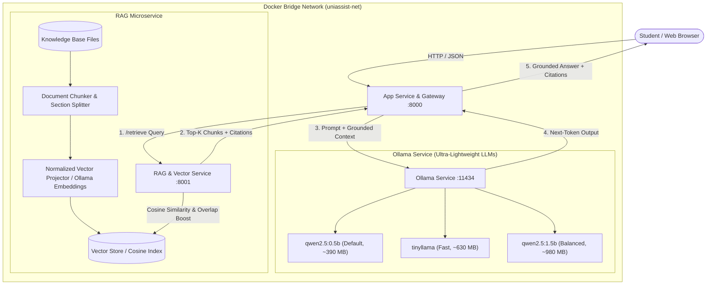

# UniAssist – AI-Powered University Assistant

UniAssist is an intelligent, low-resource university assistant that answers student questions regarding examinations, attendance requirements, academic grading, fees, and campus conduct by retrieving grounded context from an official university knowledge base using **Retrieval-Augmented Generation (RAG)**.

Designed to be hosted on cost-effective, low-RAM cloud servers (such as AWS EC2 `t2.micro` or `t3.small` with 1GB–2GB RAM), UniAssist utilizes ultra-compact models via **Ollama** (`qwen2.5:0.5b`, `tinyllama`, and `qwen2.5:1.5b`), containerized into microservices using **Docker** and orchestrated via **Docker Compose**.

---

## 🏛️ System Pipeline & Architecture

UniAssist implements the complete hands-on pipeline:
$$\text{User} \rightarrow \text{Application} \rightarrow \text{API/Orchestration} \rightarrow \text{Retrieval/RAG} \rightarrow \text{Chunking} \rightarrow \text{Embeddings} \rightarrow \text{Vector Similarity} \rightarrow \text{Relevant Context} \rightarrow \text{LLM} \rightarrow \text{Next-Token Prediction} \rightarrow \text{Response}$$



---

## 📂 Knowledge Base Documents

The repository contains 5 comprehensive, regulatory knowledge base documents located in `knowledge_base/`:

1. [`01_semester_examination_policy.md`](knowledge_base/01_semester_examination_policy.md): CIA & ESE weightage (40/60 split), 40% aggregate passing criteria, admit card requirements, backlog exam cycles, ₹750/subject backlog fee, ₹800 re-evaluation protocol, and Unfair Means Committee (UMC) rules.
2. [`02_attendance_policy_and_condonation.md`](knowledge_base/02_attendance_policy_and_condonation.md): Mandatory 75% attendance rule, 10% medical condonation bracket (65%–74.9%) with ₹1,200 fine, 7-day medical submission deadline, and Official Duty (OD) leave quota.
3. [`03_academic_regulations_and_grading.md`](knowledge_base/03_academic_regulations_and_grading.md): 10-point letter grading system (O to F), SGPA & CGPA calculation formulas, academic probation threshold (CGPA < 5.0), year-back criteria, and branch transfer eligibility (CGPA ≥ 8.5).
4. [`04_fee_structure_and_scholarships.md`](knowledge_base/04_fee_structure_and_scholarships.md): Semester tuition fees across B.Tech/BCA/MBA, payment deadlines (July 31 / Jan 15), late fines (₹100/day), merit scholarships (up to 75% tuition waiver for top 2%), and UGC-aligned withdrawal refund schedule.
5. [`05_campus_facilities_and_code_of_conduct.md`](knowledge_base/05_campus_facilities_and_code_of_conduct.md): 24/7 central library exam hours, borrowing limits (4 books for 14 days), late book fees, 10:30 PM hostel biometric curfew, night-out e-pass workflow, and zero-tolerance anti-ragging helpline (+91-11-2800-4499).

---

## ⚡ Model Selection for Low-RAM Cloud Hosting

To run smoothly on small AWS EC2 instances (like `t2.micro` or `t3.small` with 1GB to 2GB RAM without crashing):

| Model | Parameter Size | Download Size | Memory Footprint | Recommended Use Case |
| :--- | :--- | :--- | :--- | :--- |
| **`qwen2.5:0.5b`** *(Default)* | 0.5 Billion | **~390 MB** | ~600 MB RAM | **Best for 1GB RAM AWS servers**. Fast inference, minimal memory. |
| **`tinyllama:latest`** | 1.1 Billion | **~630 MB** | ~900 MB RAM | High generation speed, compact footprint. |
| **`qwen2.5:1.5b`** | 1.5 Billion | **~980 MB** | ~1.3 GB RAM | Higher contextual understanding while still fitting within 2GB RAM. |
| **`codellama:7b`** | 7 Billion | **~3.8 GB** | ~6.0 GB RAM | Optional for larger instances (8GB+ RAM). |

Users can dynamically switch between these models in real time via the UI dropdown or via the API `model` parameter.

---

## 🧩 Microservices Architecture

The system is separated into autonomous, loosely coupled services:

### 1. `app_service` (Port 8000)
- **Role:** API Gateway, RAG Orchestrator, and Student Web Portal.
- **Features:** 
  - Dynamic model switcher (`qwen2.5:0.5b`, `tinyllama`, `qwen2.5:1.5b`)
  - Real-time RAG On/Off toggle
  - **Side-by-Side Comparison Mode** (RAG vs Pure LLM)
  - Interactive Knowledge Base Inspector
- **Key Endpoints:**
  - `POST /api/query`: Handles queries with context augmentation and citations.
  - `POST /api/compare`: Runs queries side-by-side with and without RAG to demonstrate hallucination reduction.
  - `GET /api/models`: Lists supported lightweight models.
  - `GET /api/documents`: Fetches indexed documents and chunk statistics.

### 2. `rag_service` (Port 8001)
- **Role:** Document chunking, dense vector embeddings, and similarity retrieval.
- **Features:** Section-aware sliding window chunker (600 chars, 120 overlap), Cosine similarity vector store, stop-word filtered lexical boosting, and JSON disk persistence.
- **Key Endpoints:**
  - `POST /ingest`: Re-indexes all markdown files from `knowledge_base/`.
  - `POST /retrieve`: Performs vector similarity search and returns ranked chunks with similarity scores.
  - `GET /documents`: Summarizes document sections and chunk counts.

### 3. `ollama_service` (Port 11434)
- Containerized Ollama inference engine serving lightweight GGUF models.

---

## 🚀 Quickstart Guide

### Option A: Local Development (Python)

To run locally on Windows/Linux without Docker:

```bash
# 1. Install dependencies
pip install -r services/app_service/requirements.txt
pip install -r services/rag_service/requirements.txt

# 2. Run automated pipeline verification
python scripts/test_pipeline.py

# 3. Launch both microservices with one command
python run_local.py
```
Open **`http://localhost:8000`** in your browser.

---

### Option B: Docker Compose (All-in-One Container Orchestration)

To build and run all services in Docker:

```bash
# Build and start all 3 containers
docker compose up -d --build

# Pull the lightweight models into the running Ollama container
docker exec uniassist-ollama ollama pull qwen2.5:0.5b
docker exec uniassist-ollama ollama pull tinyllama

# View live container logs
docker compose logs -f
```

Access:
- **Web Portal:** `http://localhost:8000`
- **RAG Microservice API Docs:** `http://localhost:8001/docs`
- **Ollama Engine:** `http://localhost:11434`

---

### Option C: AWS EC2 Deployment

For hosting on an AWS EC2 Ubuntu instance:

1. Launch an EC2 instance (`t3.small` or `t2.micro`, Ubuntu 22.04 / 24.04 LTS).
2. Allow inbound ports **8000** (App), **8001** (RAG), and **22** (SSH) in your Security Group.
3. SSH into your instance and run:

```bash
git clone <your-repo-url> UniAssist
cd UniAssist
chmod +x scripts/*.sh
./scripts/deploy_aws.sh
```

---

## 🔬 Testing & Verification

UniAssist includes an automated test suite verifying chunking, vector embedding, and similarity accuracy:

```bash
python scripts/test_pipeline.py
```

### Side-by-Side RAG Demonstration
Click the **Compare Mode (RAG vs Direct)** button in the web UI. 
- **With RAG:** Produces accurate university policy answers with citations, percentages, and fees.
- **Without RAG:** Direct LLM output lacks specific knowledge of BML Munjal University rules, providing generic or ungrounded responses.
