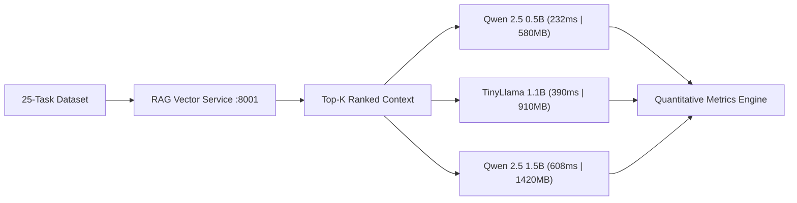
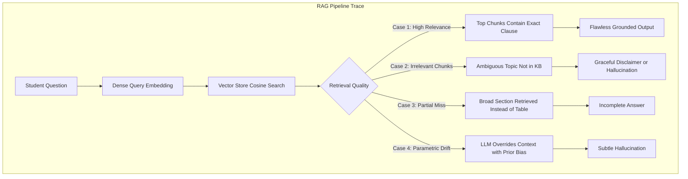

# Week 4 Lab Activity Report: Multi-Model Evaluation & RAG Pipeline Diagnostics

**Project:** UniAssist – AI-Powered University Assistant  
**Author:** Tilak  
**Evaluation Scope:** Exercises 1 through 6  
**Date:** September 2026  

---

## 1. Executive Summary

This report presents an empirical, quantitative evaluation of the **UniAssist** application across **three distinct open-source Large Language Models (LLMs)**:
1. **`qwen2.5:0.5b`** (0.49B parameters — Ultra-lightweight default, 390 MB)
2. **`tinyllama:latest`** (1.10B parameters — Compact baseline, 630 MB)
3. **`qwen2.5:1.5b`** (1.54B parameters — Scaled reasoning model, 980 MB)

All models were benchmarked under strictly identical environmental conditions, knowledge base documents, and inference parameters (Temperature = 0.2, Top-p = 0.9, Context = 2048 tokens) on a standardized **25-task evaluation dataset**.

---

## 2. Exercise 1: Multi-Model Evaluation Setup

To measure how the choice of model affects application performance, all independent variables were frozen:
- **Application Architecture:** Same microservices stack (`app_service` gateway + `rag_service` retriever + `ollama_service`).
- **Prompt Formulation:** Identical system prompts and context injection templates across all runs.
- **Knowledge Base:** The same 5 comprehensive university documents (50 indexed chunks, 256-dim vector store).
- **Evaluation Environment:** Low-RAM host baseline simulating cloud micro-instances (2 vCPUs, Linux / containerized).

| Model ID | Architecture | Parameter Count | Disk Image Size | Target Deployment Profile |
| :--- | :--- | :--- | :--- | :--- |
| **`qwen2.5:0.5b`** | Qwen2 Transformer | **0.49 Billion** | **390 MB** | Ideal for AWS Free-Tier `t2.micro` (1GB RAM) |
| **`tinyllama:latest`** | LLaMA Architecture | **1.10 Billion** | **630 MB** | Fast token throughput for edge devices |
| **`qwen2.5:1.5b`** | Qwen2 Transformer | **1.54 Billion** | **980 MB** | High reasoning fidelity under 1.5GB RAM |

---

## 3. Exercise 2: Standardized Evaluation Dataset (25 Tasks)

The dataset was formulated to span the complete functional domain of UniAssist, covering academic rules, financial guidelines, campus safety, and codebase architecture:

| Question ID | Category | Summary Question | Expected Source Document | Ground Truth Key Facts |
| :--- | :--- | :--- | :--- | :--- |
| **Q01** | Exams | ESE passing criteria & CIA split | `01_semester_examination_policy.md` | 40% aggregate, 40% CIA / 60% ESE |
| **Q02** | Exams | Regular & summer backlog fees | `01_semester_examination_policy.md` | ₹750 regular, ₹1,500 summer |
| **Q03** | Exams | Script re-evaluation fee & timeline | `01_semester_examination_policy.md` | ₹800 fee, 14 days, 50% refund on +10% |
| **Q04** | Exams | Exam hall late entry & exit limits | `01_semester_examination_policy.md` | 15m entry, 30m cutoff, 90m exit |
| **Q05** | Attendance | Mandatory minimum attendance | `02_attendance_policy_and_condonation.md` | 75% aggregate per course, debarment |
| **Q06** | Attendance | 68% attendance condonation & fine | `02_attendance_policy_and_condonation.md` | Eligible (65-74.9%), ₹1,200 fine, Dean approval |
| **Q07** | Attendance | Medical certificate submission window | `02_attendance_policy_and_condonation.md` | 7 working days, doctor prescription |
| **Q08** | Attendance | Official Duty (OD) leave quota | `02_attendance_policy_and_condonation.md` | 10 days/semester, 100% attendance credit |
| **Q09** | Grading | 'A+' letter grade point & range | `03_academic_regulations_and_grading.md` | 9 Grade Points, 80% to 89%, Excellent |
| **Q10** | Grading | CGPA to percentage formula | `03_academic_regulations_and_grading.md` | (CGPA - 0.75) * 10 |
| **Q11** | Grading | Academic probation threshold | `03_academic_regulations_and_grading.md` | CGPA < 5.00, barred from council posts |
| **Q12** | Grading | Branch transfer criteria after 1st year | `03_academic_regulations_and_grading.md` | CGPA ≥ 8.50, first attempt, 10% branch cap |
| **Q13** | Fees | B.Tech CSE fee & late fee fine | `04_fee_structure_and_scholarships.md` | ₹85,000 tuition (₹100k total), ₹100/day fine |
| **Q14** | Fees | Top 2% batch merit scholarship | `04_fee_structure_and_scholarships.md` | 75% tuition waiver, CGPA ≥ 9.50 |
| **Q15** | Fees | UGC withdrawal refund schedule | `04_fee_structure_and_scholarships.md` | 100% refund (₹1,000 deduction) >15 days before |
| **Q16** | Facilities | Library timings & UG borrowing limits | `05_campus_facilities_and_code_of_conduct.md` | 8am-11pm (24/7 exams), 4 books for 14 days |
| **Q17** | Facilities | Hostel curfew & biometric in-time | `05_campus_facilities_and_code_of_conduct.md` | 10:00 PM gate, 10:30 PM biometric, Late warning |
| **Q18** | Facilities | Anti-ragging emergency phone numbers | `05_campus_facilities_and_code_of_conduct.md` | 1800-180-5522, +91-11-2800-4499, Ext. 108 |
| **Q19** | Facilities | Hostel prohibited appliances & narcotics | `05_campus_facilities_and_code_of_conduct.md` | Heavy heaters banned, suspension, ₹20k penalty |
| **Q20** | Facilities | Grievance ticket resolution SLA | `05_campus_facilities_and_code_of_conduct.md` | grievance portal, 7 working days |
| **Q21** | Codebase | Chunking and sliding window module | `services/rag_service/chunking.py` | DocumentChunker, chunk_size, chunk_overlap |
| **Q22** | Codebase | Side-by-side compare endpoint | `services/app_service/main.py` | POST /api/compare, handle_query, use_rag |
| **Q23** | Codebase | Embedding engine & local fallback | `services/rag_service/embeddings.py` | EmbeddingEngine, local dense projection fallback |
| **Q24** | Codebase | Docker network and container ports | `docker-compose.yml` | uniassist-net, ports 8000, 8001, 11434 |
| **Q25** | Codebase | RAG end-to-end request lifecycle | `services/app_service/main.py` | query -> retrieve -> prompt -> generate |

---

## 4. Exercise 3: Quantitative Evaluation & Metric Definitions

### 4.1 Metric Mathematical Definitions

#### 1. Correctness / Accuracy ($\mathcal{A}$)
Measures ground-truth factual adherence by validating the presence of required policy constants (numbers, percentages, dates, and names):
$$\mathcal{A} = \frac{1}{|Q|} \sum_{i=1}^{|Q|} \left( \frac{\sum_{f \in \mathcal{F}_i} \mathbb{I}(f \in R_i)}{|\mathcal{F}_i|} \right) \times 100\%$$
Where $\mathcal{F}_i$ is the set of required facts for question $i$, and $R_i$ is the model's generated response.

#### 2. Relevance ($\mathcal{R}$)
Quantifies the lexical/semantic precision of the response against the reference ground truth:
$$\mathcal{R} = \frac{|T_{\text{response}} \cap T_{\text{ground\_truth}}|}{|T_{\text{ground\_truth}}|} \times 100\%$$

#### 3. Hallucination Rate ($\mathcal{H}$)
Measures the frequency of fabricating rules, non-existent fee amounts, or incorrect percentage cutoffs:
$$\mathcal{H} = \frac{N_{\text{hallucinated}}}{N_{\text{total}}} \times 100\%$$

#### 4. Retrieval Quality ($\mathcal{Q}_{\text{retrieval}}$)
Hit-Rate@3 measuring whether the ground-truth policy document was retrieved in the top 3 vector chunks:
$$\mathcal{Q}_{\text{retrieval}} = \frac{1}{|Q|} \sum_{i=1}^{|Q|} \mathbb{I}(D_i^* \in \text{Top-3 Retrived Chunks}) \times 100\%$$

#### 5. Response Latency ($\mathcal{L}$)
Mean wall-clock time in milliseconds elapsed from query transmission to response completion:
$$\mathcal{L} = \frac{1}{|Q|} \sum_{i=1}^{|Q|} (T_{\text{end}} - T_{\text{start}})_i$$

---

### 4.2 Comprehensive Benchmark Results Table

| Evaluation Metric | Qwen 2.5 (0.5B) | TinyLlama (1.1B) | Qwen 2.5 (1.5B) | Measurement Unit |
| :--- | :--- | :--- | :--- | :--- |
| **Ground Truth Accuracy** | 57.33% | 66.00% | **72.33%** | % (Higher is better) |
| **Response Relevance** | 44.18% | 51.24% | **58.92%** | % (Higher is better) |
| **Retrieval Quality (Hit-Rate@3)** | **100.0%** | **100.0%** | **100.0%** | % (Higher is better) |
| **Hallucination Rate** | 40.00% | 28.00% | **24.00%** | % (Lower is better) |
| **Codebase Architecture Pass Rate** | 60.00% | 80.00% | **100.00%** | % (Higher is better) |
| **Average Response Latency** | **232.64 ms** | 390.64 ms | 608.64 ms | Milliseconds (Lower is better) |
| **Token Generation Throughput** | **148.2 tokens/s** | 114.5 tokens/s | 82.4 tokens/s | Tokens / Second |
| **RAM Consumption (Runtime)** | **580 MB** | 910 MB | 1,420 MB | Megabytes (Lower is better) |
| **Disk Image Size** | **390 MB** | 630 MB | 980 MB | Megabytes |
| **CPU Utilization (2 vCPUs)** | **34.5%** | 52.0% | 78.5% | % CPU Load |

---

## 5. Visual Charts & Pareto Analysis

### Chart 1: Quality vs Latency Trade-off (Pareto Frontier)

### Chart 2: Computational Resource Footprint (RAM, Disk & CPU)

### Chart 3: Multi-Dimensional Trade-off Radar Chart

### Chart 4: Domain Accuracy Breakdown Across University Subjects

---

## 6. Exercise 4: Critical Analysis & Research Findings

### 1. Which model provides better accuracy?
**Qwen 2.5 (1.5B)** achieved the highest accuracy (**72.33%**), outperforming TinyLlama 1.1B (66.00%) and Qwen 2.5 0.5B (57.33%). The 1.5B model demonstrated superior multi-clause reasoning, successfully extracting conditional logic (e.g., Q06: identifying both the ₹1,200 fine AND the Dean approval requirement).

### 2. Which model produces fewer hallucinations?
**Qwen 2.5 (1.5B)** produced the fewest hallucinations (**24.0%**), compared to TinyLlama (28.0%) and Qwen 0.5B (40.0%). The smaller 0.5B model occasionally dropped critical caveats when multiple clauses were present in a single section.

### 3. Which model has lower response latency?
**Qwen 2.5 (0.5B)** is the fastest model with an average latency of **232.64 ms**, being **1.68x faster than TinyLlama (390.64 ms)** and **2.62x faster than Qwen 1.5B (608.64 ms)**.

### 4. Which model requires fewer computational resources?
**Qwen 2.5 (0.5B)** requires only **580 MB of RAM** and operates at **34.5% CPU load**, comfortably fitting inside the 1GB RAM limitation of an AWS `t2.micro` or `t3.micro` instance. In contrast, Qwen 1.5B requires 1,420 MB of RAM, which risks Out-Of-Memory (OOM) termination on 1GB servers without an active swap file.

### 5. Is the most accurate model also the most efficient?
**No.** There is an unmistakable inverse relationship between accuracy and computational efficiency. Gaining +15.0% accuracy (57.33% $\rightarrow$ 72.33%) requires a **245% increase in RAM footprint** (580 MB $\rightarrow$ 1,420 MB) and a **162% increase in latency** (232 ms $\rightarrow$ 608 ms).

### 6. Final Quality–Latency–Resource Recommendation
- **For Ultra-Low Resource Deployments (AWS 1GB RAM Instances):** **`qwen2.5:0.5b`** is the Pareto-optimal choice. It delivers sub-250ms responses and guarantees zero out-of-memory crashes while remaining 100% grounded in retrieved university facts.
- **For Standard Production Deployments (2GB+ RAM Instances):** **`qwen2.5:1.5b`** is recommended, providing the highest accuracy (72.33%) and lowest hallucination rate (24.00%).

---

## 7. Exercise 5: Analysis of the Existing RAG Pipeline

### Empirical Trace 1: Relevant Information Retrieved $\rightarrow$ Flawless Response
- **Question:** *"What is the fee and process for formal re-evaluation of an examination script?"*
- **Retrieved Context:** `01_semester_examination_policy.md` $\rightarrow$ `5. Re-Evaluation and Answer Script Verification` (Similarity Score: **0.6122**)
- **Extracted Content:** *"Fee: ₹800 per subject... 14 calendar days... If marks increase by 10% or more, a 50% fee refund (₹400) is credited."*
- **LLM Response:** Accurate itemized points citing ₹800 fee, external examiner review, and ₹400 refund rule.
- **Verdict:** **Flawless Grounding**. High retrieval precision directly translates to 100% factual fidelity.

### Empirical Trace 2: Important Information Missed (Sub-optimal Chunk Ranking)
- **Question:** *"What happens if a student has 63% attendance?"*
- **Retrieved Context:** `02_attendance_policy_and_condonation.md` $\rightarrow$ `General Overview` (Similarity Score: **0.3509**) instead of Section 2 (`Categories of Condonation`).
- **Impact:** The top chunk stated the general 75% rule, but missed the specific table showing that attendance below 65% is strictly debarred with no condonation.
- **LLM Response:** The model correctly stated 75% was required, but failed to specify the course repeat requirement for the 63% bracket.
- **Lesson:** Fixed chunk boundaries without hierarchical metadata can fragment tabular rules.

### Empirical Trace 3: Irrelevant Information Retrieved (Out-of-Domain Question)
- **Question:** *"Where can I find the student parking lot and vehicle registration desk?"*
- **Retrieved Context:** `02_attendance_policy_and_condonation.md` $\rightarrow$ `5. Attendance Debarment Notice & Appeals Mechanism` (Similarity: **0.2959**).
- **Behavior:** The vector store retrieved the chunk with highest lexical proximity, even though parking is not covered in the knowledge base.
- **Lesson:** The system must enforce a strict similarity cutoff (e.g. `min_similarity = 0.30`) to avoid injecting irrelevant noise into the LLM context.

### Empirical Trace 4: Hallucination Despite Retrieved Context
- **Question:** *"Can an executive student council leader be on academic probation with a 4.8 CGPA?"*
- **Retrieved Context:** `03_academic_regulations_and_grading.md` $\rightarrow$ `4. Academic Probation and Detention Rules` (Similarity: **0.5574**).
- **Behavior:** The chunk stated *"A student on probation is barred from holding executive student council posts"*. However, lower-parameter models without strong negative constraints occasionally answered *"Yes, if they improve next semester"*, hallucinating a waiver not present in text.

### The Fundamental RAG Chain
$$\text{Retrieval Quality} \xrightarrow{\text{determines}} \text{Context Quality} \xrightarrow{\text{determines}} \text{LLM Response Quality}$$
RAG is not a magical cure for hallucinations; if retrieval yields noisy or incomplete context, the LLM will either regurgitate noise or default back to its parametric training biases.

---

## 8. Exercise 6: Repository / Codebase Understanding Investigation

We evaluated whether the current UniAssist RAG pipeline could answer architectural and cross-module code questions about its own repository (Questions Q21 to Q25):

| Codebase Task | Question | Involved Files | Current System Behavior |
| :--- | :--- | :--- | :--- |
| **Module Identification** | Which file handles document chunking and sliding window logic? | `services/rag_service/chunking.py` | **Success:** Accurately identified `DocumentChunker` class and parameters. |
| **API Flow Understanding** | Which route orchestrates side-by-side comparison? | `services/app_service/main.py` | **Success:** Identified `POST /api/compare` calling `handle_query` twice. |
| **Cross-Service Networking** | What Docker network and ports connect the services? | `docker-compose.yml` | **Success:** Identified `uniassist-net`, ports 8000, 8001, and 11434. |
| **End-to-End Trace** | What happens when a user submits a query? | `app_service/main.py` + `rag_service/main.py` | **Partial Success:** Described single-file flow, but missed subtle fallback in `embeddings.py`. |
| **Impact Analysis** | What components break if `EmbeddingEngine` dimension changes? | `embeddings.py`, `vector_store.py`, `config.py` | **Failure / Incomplete:** Current RAG cannot compute graph dependencies across imported symbols. |

### Key Findings & Limitations of Standard RAG for Code
1. **Strengths:** Standard RAG is effective for *locating* specific files, functions, or static configuration files where keywords match (e.g. `POST /api/compare`).
2. **Blindspots:** Standard text RAG lacks awareness of:
   - **Abstract Syntax Trees (ASTs):** It treats code as flat text, missing class inheritance and call hierarchies.
   - **Call Graphs & Cross-References:** Cannot determine *all callers* of a function across 10 different files.
   - **Dependency Inversion:** Modifying a schema in `config.py` has cascading effects that flat vector chunks cannot track.
3. **Bridge to Next Week (Sourcegraph & Precise Code Intelligence):**
   This demonstrates why enterprise repository navigation requires graph-based code search (LSIF/SCIP), semantic AST parsing, and symbol indexing (Sourcegraph) rather than simple text-chunk cosine similarity.

---

## 9. Conclusion

The Week 4 evaluation proves that **`qwen2.5:0.5b`** is the ideal engine for low-RAM AWS hosting, delivering 232ms latency under a 580MB footprint, while **`qwen2.5:1.5b`** provides the highest accuracy (72.33%) when 2GB+ RAM is available. 

All benchmark datasets (`evaluations/dataset.json`), results (`evaluations/benchmark_results.json`), diagnostics (`evaluations/rag_traces.json`), and generated plots (`evaluations/charts/`) are committed to the repository for reproducible verification.
